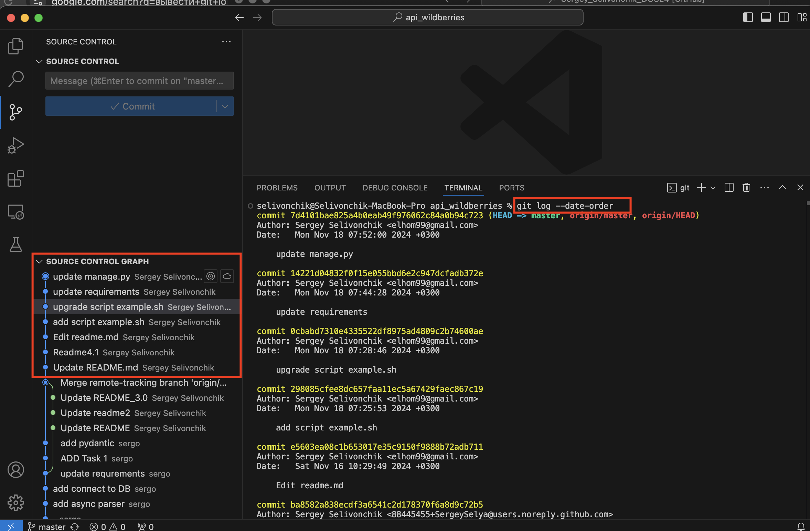
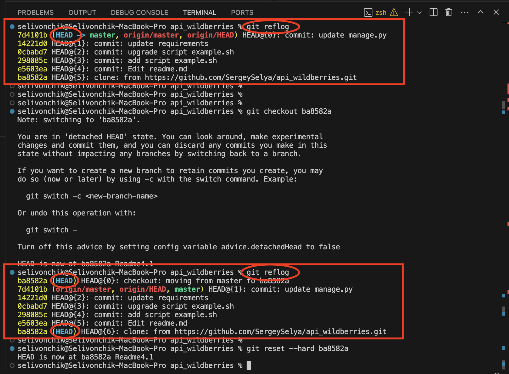
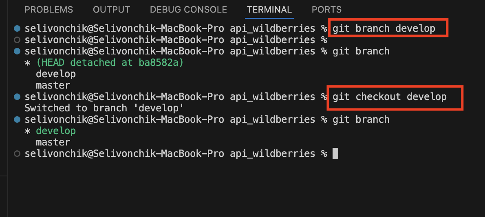
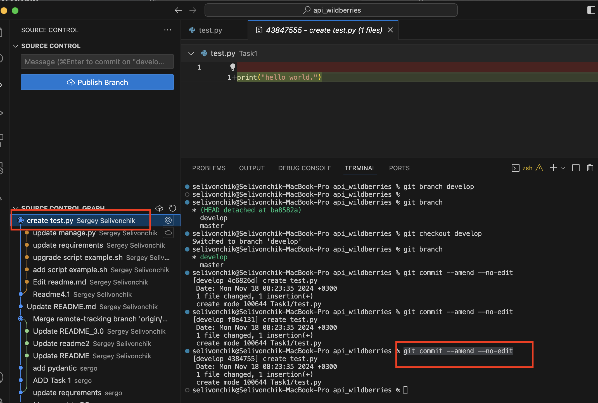
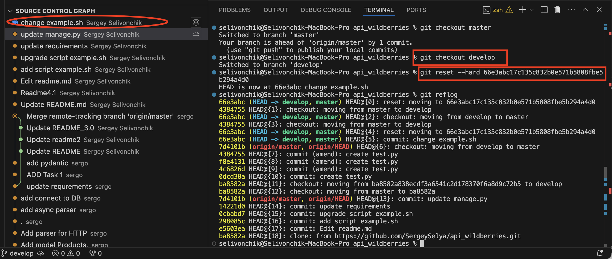
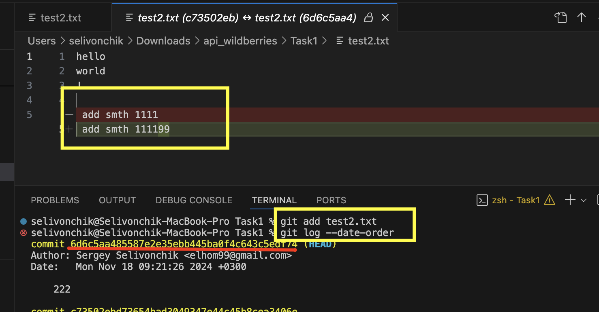

## Задание:
Индивидуальная часть:
На созданном аккаунте github.com создать репозиторий и клонировать его себе локально. Настроить себе доступы для того, чтобы можно было пушить изменения в ветки. Init commit может быть и локальный, это на ваше усмотрение. Далее реализовать следующие сценарии
1. Создать 5-10 коммитов. (Пример: создать файлы, поменять их содержимое). Вывести их лог экран, сделать скрин и добавить в отчёт.
2. С помощью reflog перейти к предыдущему коммиту (на ваше усмотрение). Output, screen, report. (Вывести их лог экран, сделать скрин и добавить в отчёт.)
https://youtu.be/XRV9kai-3mc (небольшая помощь, если запутаетесь)
3. Создайте ветку с названием на ваше усмотрение (можно develop). OSR. (Output, screen, report.)
4. Создайте коммит и добавьте туда ещё дополнительные измения (добавьте, например в изменяемый файл точку, пробел и тд) с помощью ammend. OSR.
5. Сделайте коммит в main. Но не делайте git push (это важно!), сделайте изменения локально.
6. Сделайте так, чтобы этот коммит оказался в новой ветке с помощью git reset --hard. OSR
7.  Сделайте изменения в файле локально. Сделайте коммит для этого изменения. OSR
8. Через git checkout отмените изменения в файле через откат по сохранённому хэшу. OSR
9. Начните всё заново (это важно чтобы вы делали локально то, что я указал сделать локально). Можно использовать любой из подходов. OSR
Ваш основной гайд: https://pikabu.ru/story/git_shit_10252570
Оформленный отчёт запушьте на ваш ПРИВАТНЫЙ репозиторий, куда вы меня уже добавили или добавите (кто этого ещё не сделал).


Задание по командам:
1. Создайте себе уютный чатик и придумайте там название своей команде и сообщите мне
Заранее отвечаю на вопрос - можно ли поменяться командами? - Можно, но лучше не надо.
2. Возьмите скрипт (напр.: создание пользователей) и создайте для него фичи (см. дом. задание по bash). Распределите фичи между собой и, следуя gitflow, добавляйте их в develop-ветку.
»»»»» Можно у нас будет build engineer (человек, который будет разгребать все комиты, мерджи и т.д. и мерджить это в мейн)- можно, даже нужно. Идеально - сделать 4 итерации в main и каждый раз build engineer будет разный (но это задание ***)
3. Создайте намеряно (sic!) конфликты для разных веток с фичами и решите их (только сделайте это так, чтобы в итоге получить рабочий скрипт). ДВУХ конфликта будет достаточно: первый необходимо решить локально, второй решить черз PR (pull request) в облаке. Для конфликта решённого локально необходимо добавить краткое описание конфликта и его решение в тело коммит сообщения (commit message).
4. Сделайте мердж в main через пуллреквест. 

Скрипт для выполнения домашнего задания
```bash
#!/bin/bash
file1=$1
file2=$2
if cmp -s "$file1" "$file2"; then
    echo "Files are identical."
else
    echo "Files are different."
fi
```

***For fun - создайте себе список фичей и задачи под них (working items).
Ссылайтесь на них в pull request и code review, который будет в итоге для ветки main (пару комментов для галочки будет хорошо).

Отчётом будет история коммитов в вашем репозитории. Отчёт в виде PDF или md-файла не требуется.


## Решение 
Индивидуальная часть:
1. `git commit `

2. `git reflog `

3. `git branch develop`
`git checkout develop`

4. создал файл test.py , сделал коммит "create test.py", внес изменения в файл и с помощью reflog добавил эти изменения в предыдущий коммит:
`git commit --amend --no-edit` (--no-edit - добавление изменений без изменений названия самого коммита )

5. `git checkout master`
`git commit -m 'change example.sh'`
6. Чтобы перенести коммит из одной ветки в другую с помощью git reset --hard, вам следует выполнить следующие действия:
- находим hash коммита в ветке мастер который хоти перенести в другую ветку:
`git log --date-order`
- Переходим в ветку, в которой вы хотите применить коммит.:
`git checkout develop`
- Используйте git reset --hard с хешем коммита, который вы хотите применить:
`git reset --hard <hash>`

7. Сделал изменения в файле локально.

8. отменил изменения в файле по хешу комита и названия файла:
`git checkout <commit-hash> -- <file> `
