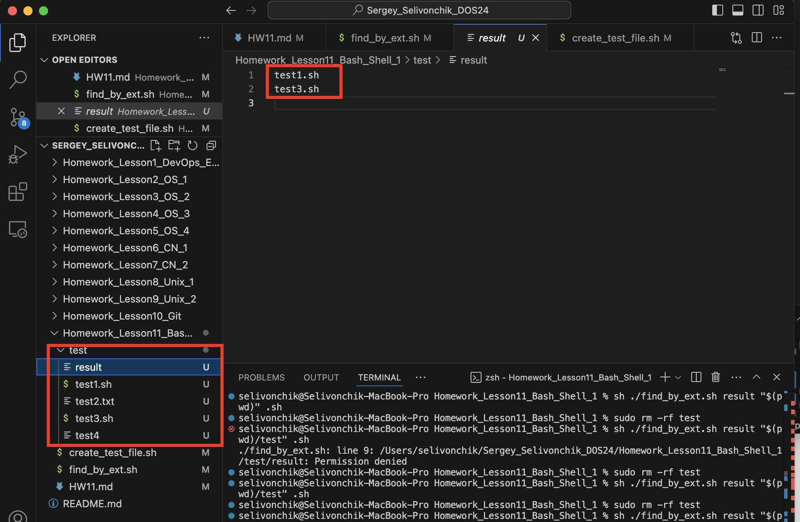
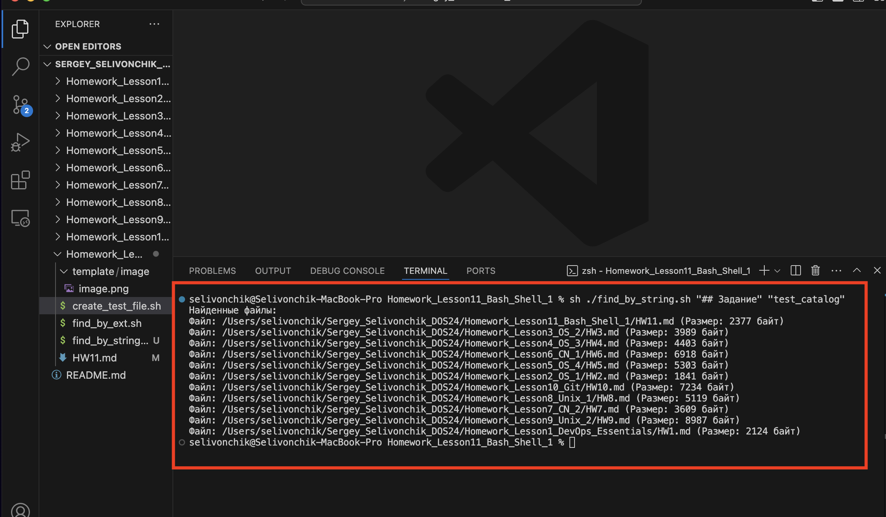

## Задание:
1. Написать скрипт, выводящий в файл (имя файла задаётся
пользователем в качестве первого аргумента командной строки) имена
всех файлов с заданным расширением (третий аргумент командной
строки) из заданного каталога (имя каталога задаётся пользователем в
качестве второго аргумента командной строки).

2. Файлы сгенерировать мне самому*** Написать скрипт для поиска заданной пользователем строки во всех
файлах заданного каталога и всех его подкаталогах (строка и имя
каталога задаются пользователем в качестве первого и второго
аргумента командной строки). На консоль выводятся полный путь и
имена файлов, в содержимом которых присутствует заданная строка, и
их размер. Если к какому-либо каталогу нет доступа, необходимо
вывести соответствующее сообщение и продолжить выполнение

## Решение
1. Задание 1:
Для проверки первого задание , перейдите в каталог HW11 
```bash
cd /Homework_Lesson11_Bash_Shell_1/
```
и запустите следущую команду в терминале:
```bash
 sh ./find_by_ext.sh result "$(pwd)/test" .sh
 # создасться тестовая папка, с тестовыми файлами
 # результат поиска по тестовому каталогу запишется в result

 sh ./find_by_ext.sh param1 param2 paran3
 # param1 - Имя нового файла в который запишеться вывод скрипта
 # param2 - каталог по которому будет идти поиск файлов
 # paran3 - искомое расширение файлов 

```


2. Задание 2:
Для проверки первого задание , перейдите в каталог HW11 
```bash
cd /Homework_Lesson11_Bash_Shell_11/
```
и запустите следущую команду в терминале:
```bash
sh ./find_by_string.sh "## Задание" "test_catalog"    

sh ./find_by_string.sh param1 param2 
 # param1 - искомая строка в файлах
 # param2 - каталог по которому будет идти поиск файлов
                                               
```
