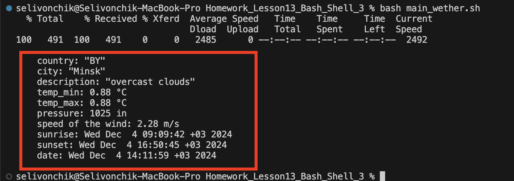

## Задание:
1.  Домашнее задание для PowerShell/BASH

    Можно на выбор взять сервис: 
    OpenWeather (https://openweathermap.org/)
    StarWars (https://swapi.dev/)
    1. Через функцию составить запрос к API (внимательно посмотрите документацию сервиса), получить данные.
    2. Составить функцию, которая будет забирать данные вашего запроса и представлять их в читаемом виде. После того как вы запишите это в виде скрипта, запустите его, вы сможете вызывать вашу функцию наподобие командлета.
    3. Добавить один  (*два) входных параметра (абсолютно любой, например, название города для сервиса погоды либо номера страницы из массива персонажей)
    4.*** Добавить возможность получать прогноз по выбранному городу на 4 и на 16 дней. Также добавить входящий парамерт для выбора единицы измерения температуры (C либо F). Также добавить возможность выбора языка

## Решение
1.  программа состоих из трех функциональных модулей:
    * main_weather() - Главная программа, в ней передаем переменные для API запроса и вызываем два ниже представленных модуля.
    * api_call_wether() - Получает api запрос в json и сохраняет его, на основе передданых переменных.
    * parser_core_weather() - На основе сохраненного json парсит данные и выводит в консоль.
     Для проверки первого задание , перейдите в каталог HW13
    ```bash
    cd Homework_Lesson13_Bash_Shell_3/
    ```
    и запустите следущую команду в терминале:
    ```bash
    bash main_wether.sh
    
    # в файле находятся переменные /main_wether.sh
    CITY="Minsk" - город
    UNITS="m" - еденицы измерения температуры (i-imperial, m-metric, * metric unit is default)
    LANG="en" - язык
    COUNT_DAY=8 - кол-во дней
    ```
    