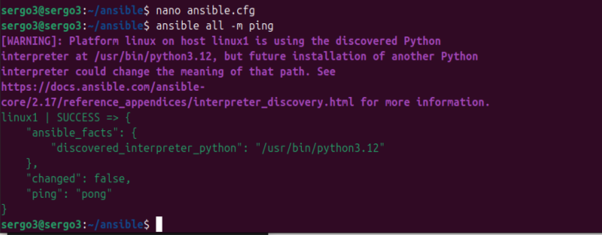

## Задание:
Цель: получить практический опыт работы с системой управления
конфигурацией Ansible

## ЧАСТЬ 1
! перед началом работы с Ansible, разверните еще одну виртуальную
машину,которая будет менеджиться с помощью него.

Задание 1: установить Ansible
Обновите список пакетов:
```bash
sudo apt update
```
Установите пакет software-properties-common, который позволит добавлять репозитории:
```bash
sudo apt install software-properties-common
```
Добавьте репозиторий Ansible PPA:
```bash
sudo apt-add-repository ppa:ansible/ansible
```
Обновите список пакетов:
```bash
sudo apt update
```
Установите Ansible:
```bash
sudo apt install ansible
```
Задание 2: сгенерировать SSH-ключ
● Откройте терминал на вашем контролирующем хосте.
● Запустите команду для генерации ключа:
```bash
ssh-keygen -t rsa -b 4096
```
При выполнении этой команды вам будет предложено ввести путь к файлу, в котором будет сохранен ключ, а также парольная фраза (пароль не обязателен, но рекомендуется).
После того, как ключ будет сгенерирован, скопируйте его на управляемый хост:
```bash
# команду выполняем на мастер хосте
ssh-copy-id user@managed_host
# ssh-copy-id vboxuser@192.168.100.59
```
В этой команде "user" - это имя пользователя на управляемом хосте, а "managed_host" - имя или IP-адрес управляемого хоста.
● При выполнении этой команды вам будет предложено ввести пароль
пользователя на управляемом хосте.
● После успешной передачи ключа на управляемый хост вы можете
использовать Ansible для управления им.
Задание 3: просмотрите и повторите все манипуляции, указанные в
видеоуроке по ссылке
https://www.youtube.com/watch?v=O5R6EBdaZZg&list=PLg5SS_4L6LYufspdPu
pdynbMQTBnZd31N&index=4
В данном ролике рассматривается шаги подключения к серверам Linux.

## ЧАСТЬ 2
Цель: настроить Ansible окружение на вашей машине, чтобы вы могли
использовать его для автоматизации управления конфигурацией и
развертывания приложений на удаленных серверах.
Задание: Настройка Ansible окружения
Шаги:
1. Установите Ansible на вашу локальную машину. В зависимости от
операционной системы, которую вы используете, установка может
отличаться. Инструкции по установке Ansible можно найти на официальном
сайте: https://docs.ansible.com/ansible/latest/installation_guide/index.html
2. Создайте инвентарный файл, который содержит информацию о
серверах, которые вы планируете управлять с помощью Ansible.
Инвентарный файл может быть в формате ini или YAML. Например:
[servers]
server1 ansible_host=192.168.1.100 ansible_user=myuser
ansible_ssh_private_key_file=/path/to/key.pem
server2 ansible_host=192.168.1.101 ansible_user=myuser
ansible_ssh_private_key_file=/path/to/key.pem
В этом примере мы определяем два сервера с IP-адресами 192.168.1.100 и
192.168.1.101. Мы также указываем имя пользователя и путь к файлу с
приватным ключом SSH, который Ansible будет использовать для
аутентификации.
3. Создайте файл конфигурации Ansible, который будет содержать
глобальные настройки Ansible. Файл конфигурации Ansible может быть
расположен в нескольких местах, включая каталоги /etc/ansible и ~/.ansible/.
Например:
[defaults]
inventory = /path/to/inventory_file
remote_user = myuser
private_key_file = /path/to/key.pem
В этом примере мы указываем путь к инвентарному файлу, имя пользователя
SSH и путь к файлу с приватным ключом SSH, который Ansible будет
использовать для аутентификации.
4. Создайте простой плейбук Ansible, который будет выполнять простую
задачу на одном из ваших серверов. Например, вы можете создать плейбук,
который устанавливает пакеты на сервере. Пример
---
- name: Install packages
hosts: servers
become: true
tasks:
- name: Install Nginx
apt:
name: nginx
state: present
В этом примере мы создаем плейбук, который устанавливает пакет Nginx на
всех серверах, определенных в инвентарном файле. Мы также указываем, что
Ansible должен использовать привилегии root для выполнения

## Решение

Разворачиваем два хоста Master и Slave ansible и настраеваем их.
Заходим на master хост :
```bash
sudo apt update
sudo apt install software-properties-common
#Добавьте репозиторий Ansible PPA:
sudo apt-add-repository ppa:ansible/ansible
sudo apt update
# Устанавливаем Ansible:
sudo apt install ansible
# генерируем SSH-ключ
ssh-keygen -t rsa -b 4096
# команду выполняем на мастер хосте(копируем публичный ключ c Master на Slave)
ssh-copy-id user@managed_host
# ssh-copy-id vboxuser@192.168.100.59
```

Настраиваем рабочую директорию  ansible на Мастере.
```bash
# создаем рабочюю папку ansible на мастер хосте
mkdir ansible
cd ansible
nano hosts.txt
#добовляем ip адресса управляемых хостов
[servers]
linux1 ansible_host=192.168.100.59 ansible_user=vboxuser
# если не пропросили публичный ключ а сохранили ключ slave сервера локально на мастере , нужно дописать строку c указанием приватного ключа если он рассположен не в стандартном месте "ansible_ssh_private_key_file=/home/user/.ssh/key.pem"

#добавим конфиг файл 
cd ansible
nano ansible.cfg
# заполняем
[defaults]
host_key_checking = false
inventory         = ./hosts.txt # чтобы не прописывать инвентори в команде ansible 
#запустим модуль ping для проверки ansible
ansible -i hosts.txt all -m ping
#можем не указывать inventory тк прописали его в ansible.cfg
```


Создаем плейбук для установки nginx
```bash
# Создаем файл и записываем его
nano install_nginx.yml

---
- name: Install packages
hosts: servers
become: true
tasks:
- name: Install Nginx
apt:
name: nginx
state: present

# hosts: servers — Плейбук будет выполняться на хостах, которые указаны в группе servers вашего инвентаря (например, hosts).
# become: true — Используется для выполнения задач с привилегиями пользователя root (через sudo).
# tasks: — Секция, в которой перечисляются задачи для выполнения.
# name: Install Nginx — Описание задачи, что она будет делать.
# apt: — Модуль, который управляет пакетами в системах на базе Debian (например, Ubuntu).
# name: nginx — Указываем, что нужно установить пакет nginx.
# state: present — Указывает, что пакет должен быть установлен (если он уже установлен, то ничего не изменится).
```
```bash
# Укажем ansible_become_password='your_sudo_password' в файле hosts.txt:
nano hosts.txt

[servers]
linux1 ansible_host=192.168.100.59 ansible_user=vboxuser ansible_become_password='your_sudo_password' # указывает пароль для sudo

#Запускаем плейбук
ansible-playbook install_nginx.yml
```
