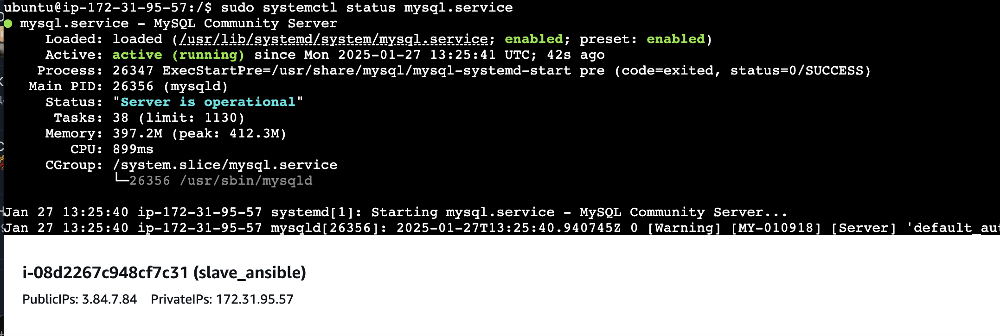

## Задание:
Цель: получить практический опыт работы c Ansible-ролями

Задание 1: просмотрите и повторите все манипуляции, указанные в
видеоуроке по ссылке
https://www.youtube.com/watch?v=9pHMZnb3JDQ
В данном ролике рассматриваются для настройки Ansible-ролей.

Задание 2: (опционально, на выбор):
- Роль для установки и настройки веб-сервера. Напишите роль, которая
устанавливает веб-сервер (например, Apache или Nginx), настраивает
его для работы с вашим приложением и добавляет необходимые
конфигурационные файлы. Роль должна принимать переменные для
конфигурирования сервера, такие как порт, на котором он будет
слушать и путь к вашему приложению.
- Роль для настройки базы данных. Напишите роль, которая
устанавливает и настраивает базу данных (например, MySQL или
PostgreSQL). Роль должна принимать переменные для
конфигурирования базы данных, такие как пароль для
root-пользователя и порт, на котором база данных будет слушать.
- Роль для настройки мониторинга сервера. Напишите роль, которая
устанавливает и настраивает инструменты мониторинга (например,
Nagios или Zabbix) на ваш сервер. Роль должна принимать переменные
для конфигурирования инструментов мониторинга, такие как адрес
электронной почты для оповещений.
- Роль для установки и настройки приложения. Напишите роль, которая
устанавливает ваше приложение, настраивает его для работы с базой
данных и веб-сервером, добавляет необходимые конфигурационные
файлы и запускает его в качестве сервиса. Роль должна принимать
переменные для конфигурирования приложения, такие как адрес базы
данных и порт веб-сервера.
- Роль для управления пользователями и группами. Напишите роль,
которая создает пользователей и группы на вашем сервере, назначает
им права доступа к файлам и каталогам и настраивает SSH-доступ для
каждого пользователя. Роль должна принимать переменные для
конфигурирования пользователей и групп, такие как имена
пользователей и групп и их пароли.
- Роль для установки и настройки SSL-сертификатов. Напишите роль,
которая устанавливает SSL-сертификаты на ваш сервер, настраивает
веб-сервер для работы с ними и добавляет необходимые
конфигурационные файлы. Роль должна принимать переменные для
конфигурирования SSL-сертификатов, такие как путь к сертификату и к
приватному ключ

## Решение

Создал две вм в AWS
master_ansible = 54.163.49.116
slave_ansible = 3.84.7.84


сгенерировал ключ для ssh подключения к slave
скопировал ключ на мастрел о ограничил его доступ:
```bash
chmod 600 ~/.ssh/rsa_key_slave.pem
ssh -i ~/.ssh/rsa_key_slave.pem  ubuntu@3.84.7.84
```

## Создаем роль для установки Nginx
1) создаем рабочюю папку ansible на мастер хосте
```bash
mkdir ansible
cd ansible
nano hosts.txt
#добовляем ip адресса управляемых хостов
[servers]
linux_slave ansible_host=3.84.7.84 ansible_user=ubuntu ansible_ssh_private_key_file=~/.ssh/rsa_key_slave.pem

# если не пропросили публичный ключ а сохранили ключ slave сервера локально на мастере , нужно дописать строку c указанием приватного ключа если он рассположен не в стандартном месте "ansible_ssh_private_key_file=/home/user/.ssh/key.pem"
```

2) запустим модуль ping для проверки ansible
```bash
ansible -i hosts.txt all -m ping
```

3) создаем рабочюю папку roles на мастер хосте
```bash
mkdir roles
cd roles
ansible-galaxy init deploy_apache_web
```


4) оперделяем переменные
Переменные для конфигурирования веб-сервера, такие как порт и путь к приложению, будут храниться в файле defaults/main.yml.
```bash
cd roles/deploy_apache_web/defaults/
nano main.yml
---
# Значения по умолчанию для настройки веб-сервера
webserver_port: 80
app_path: /var/www/html
```

5) Теперь создадим задачи для установки и настройки веб-сервера в roles/webserver/tasks/main.yml.
```bash
cd roles/deploy_apache_web/tasks/
nano main.yml
# Установка веб-сервера (например, Nginx)
- name: Установить Nginx
  apt:
    name: nginx
    state: present
  become: yes

# Настройка конфигурации веб-сервера
- name: Копировать конфигурационный файл Nginx
  template:
    src: nginx.conf.j2
    dest: /etc/nginx/nginx.conf
  become: yes
  notify:
    - Перезапустить Nginx

# Создание директории для приложения
- name: Создать директорию для приложения
  file:
    path: "{{ app_path }}"
    state: directory
    mode: '0755'
  become: yes

# Копирование файлов приложения (если они есть)
#- name: Копировать файлы приложения
#  copy:
#    src: /path/to/your/app/files/
#    dest: "{{ app_path }}"
#    mode: '0644'
#  become: yes

# Запуск и включение Nginx
- name: Убедиться, что Nginx работает
  service:
    name: nginx
    state: started
    enabled: yes
  become: yes

# Убедитесь, что Nginx слушает на нужном порту
- name: Обновить конфигурацию для прослушивания нужного порта
  lineinfile:
    path: /etc/nginx/sites-available/default
    regexp: '^listen'
    line: "listen {{ webserver_port }};"
  become: yes
  notify:
    - Перезапустить Nginx
```

6) Теперь создадим шаблон конфигурации Nginx, который будет использовать переменные, переданные в роль. Файл будет называться nginx.conf.j2 и будет находиться в папке templates.
```bash
cd roles/deploy_apache_web/templates/
nano nginx.conf.j2
####
events {
    worker_connections 1024;  # Количество максимальных соединений для одного рабочего процесса
}
http {
    server {
        listen {{ webserver_port }};
        server_name localhost;

        root {{ app_path }};
        index index.html;

        location / {
            try_files $uri $uri/ =404;
        }
    }
}
###
```

7) Создаём обработчик для перезапуска Nginx, который будет вызываться, если конфигурация изменится.
```bash
cd roles/deploy_apache_web/handlers/
nano main.yml
---
# handlers file for deploy_apache_web
- name: Перезапустить Nginx
  service:
    name: nginx
    state: restarted
  become: yes
```

8) Теперь создадим основной файл playbook, который будет запускать роль webserver на нужном хосте (slave). Файл будет называться site.yml.
```bash
cd /ansible
nano site.yml
---
- hosts: all
  become: yes
  roles:
    - deploy_apache_web
```
9) запускаем плейбук 
```bash
ansible-playbook -i hosts.txt site.yml
```


## Создаем роль для установки и настройки python
1) заходим в рабочюю папку ansible/roles на мастер хосте
```bash
cd /ansible/roles
```
2) создаем структуру папок для роли db_setup.
```bash
ansible-galaxy init python3_install
```
3) создаем задачи для установки Python 3
```bash
cd roles/python3_install/tasks
nano main.yml

# python3_install/tasks/main.yml

---
- name: Обновить список пакетов
  apt:
    update_cache: yes
  become: yes

- name: Установить Python 3
  apt:
    name: python3
    state: present
  become: yes

- name: Установить pip3
  apt:
    name: python3-pip
    state: present
  become: yes

- name: Установить зависимости для работы с MySQL (если необходимо)
  apt:
    name:
      - python3-dev
      - libmysqlclient-dev
      - python3-pymysql
    state: present
  become: yes

```
4) в hosts.txt добовляем информацию о python интерпритаторе ansible_python_interpreter=/usr/bin/python3
```bash
[servers]
linux_slave ansible_host=3.84.7.84 ansible_user=ubuntu ansible_ssh_private_key_file=~/.ssh/rsa_key_slave.pem ansible_python_interpreter=/usr/bin/python3
```

5) в любом файле запуска playbook указываем установку роли python
```bash
- name: Установка python
  hosts: all
  become: yes
  roles:
    - python3_install
```


## Создаем роль для установки и настройки MySQL

1) заходим в рабочюю папку ansible/roles на мастер хосте
```bash
cd /ansible/roles
```
2) создаем структуру папок для роли db_setup.
```bash
ansible-galaxy init db_setup
```
3) создаем переменные для конфигурации базы данных
В файле defaults/main.yml можно определить переменные для конфигурации базы данных, такие как пароль для root-пользователя и порт.
```bash
cd roles/db_setup/defaults/
nano main.yml

# db_setup/defaults/main.yml
mysql_root_password: "root_password"    # Пароль для root-пользователя
mysql_port: 3306                        # Порт, на котором будет слушать MySQL
mysql_bind_address: "0.0.0.0"           # IP-адрес, на котором будет слушать MySQL
```
4) Задачи для установки и настройки MySQL
В файле tasks/main.yml определим шаги для установки MySQL и его настройки.
```bash 
cd db_setup/tasks/
nano main.yml

---
# db_setup/tasks/main.yml

- name: Обновить список пакетов
  apt:
    update_cache: yes
  become: yes

- name: Установить MySQL сервер
  apt:
    name: mysql-server
    state: present
    update_cache: yes
  become: yes

- name: Установить MySQL клиент
  apt:
    name: mysql-client
    state: present
  become: yes
- name: Настроить MySQL (my.cnf)
  template:
    src: my.cnf.j2
    dest: /etc/mysql/mysql.conf.d/mysqld.cnf
  become: yes
  notify:
    - Перезапустить MySQL

- name: Установить пароль для root пользователя
  mysql_user:
    login_unix_socket: /var/run/mysqld/mysqld.sock
    name: root
    password: "{{ mysql_root_password }}"
    host: localhost
    login_user: root
    login_password: "{{ mysql_root_password }}"
    state: present
  become: yes

- name: Разрешить доступ к MySQL
  ufw:
    rule: allow
    port: 3306
    proto: tcp
  become: yes

- name: Перезапустить MySQL
  systemd:
    name: mysql
    state: restarted
    enabled: yes
  become: yes
```
5) Шаблон конфигурации MySQL
В файле templates/my.cnf.j2 создадим шаблон конфигурации MySQL. Этот шаблон будет использовать переменные для настройки порта и IP-адреса, на котором будет слушать MySQL.
```bash
cd db_setup/templates/
nano my.cnf.j2

# db_setup/templates/my.cnf.j2
[mysqld]
bind-address = {{ mysql_bind_address }}
port = {{ mysql_port }}
max_connections = 100
default_authentication_plugin = mysql_native_password
```
6) Обработчики для перезапуска MySQL
В файле handlers/main.yml создадим обработчик, который будет перезапускать MySQL после изменения конфигурации.
```bash
cd db_setup/handlers
nano main.yml

# db_setup/handlers/main.yml
---
- name: Перезапустить MySQL
  systemd:
    name: mysql
    state: restarted
    enabled: yes
  become: yes

```

7) Создание Playbook для запуска роли
Создание Playbook для запуска роли mysql.yml
```bash
cd ansible
nano mysql.yml

---
- name: Установка python
  hosts: all
  become: yes
  roles:
    - python3_install

- name: Установить и настроить MySQL на слейв-хосте
  hosts: all
  become: yes
  roles:
    - db_setup
  vars:
    mysql_root_password: "your_secure_root_password"
    mysql_port: 3306
    mysql_bind_address: "0.0.0.0"
```
8) Указание интерпретатора Python 3 для Ansible mysql
```bash
cd /ansible
nano mysql.yml

---
- name: Установка python
  hosts: all
  become: yes
  roles:
    - python3_install
- name: Установить и настроить MySQL на слейв-хосте
  hosts: all
  become: yes
  roles:
    - db_setup
  vars:
    mysql_root_password: "your_secure_root_password"
    mysql_port: 3306
    mysql_bind_address: "0.0.0.0"
```

9) запускаем плейбук 
```bash
ansible-playbook -i hosts.txt mysql.yml
```



