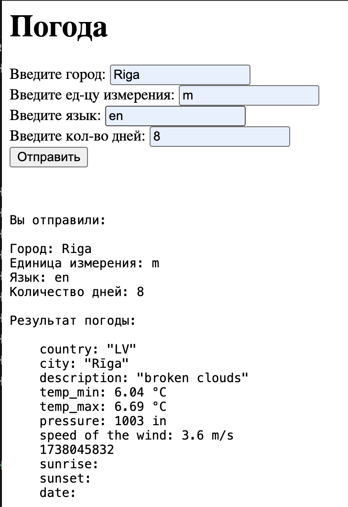

## Задание:

Выберите одно или несколько заданий из приведённого списка и выполните их.

Обязательный минимум задач к выполнению: 5 из основного блока. Задания из не основного блока выполняются по желанию

### **Задания:*
1. **Проверка доступности IP-адресов:**
- Напишите скрипт, который принимает на вход список IP-адресов и проверяет их доступность с помощью ping-запросов. Результаты проверки должны сохраняться в отдельный файл.

2. **Уникальность элементов в кортеже:**
- Напишите скрипт, который принимает на вход кортеж и проверяет, все ли его элементы являются уникальными.

3. **Поиск файлов по подстроке:**
- Напишите скрипт, который принимает на вход список файлов и находит те, имена которых содержат определённую подстроку.

4. **Общие символы в строках:**
- Напишите скрипт, который принимает на вход две строки и выводит на экран все символы, которые встречаются в обеих строках.

5. **Статистика списка чисел:**
- Напишите скрипт, который принимает на вход список чисел и вычисляет медиану, среднее арифметическое и дисперсию этого списка.

6. **Замена гласных в строке:**
- Напишите скрипт, который принимает на вход строку и заменяет в ней все гласные буквы на символ "-".

7. **Общие и уникальные элементы списков:**
- Напишите скрипт, который принимает на вход два списка, находит их общие элементы и создаёт новый список, содержащий только уникальные элементы.

8. **Фильтрация чисел в списке:**
- Напишите скрипт, который принимает на вход список чисел и удаляет из него все числа, которые меньше заданного пользователем значения.

9. **Сортировка строк по длине:**
- Напишите скрипт, который принимает на вход список строк и сортирует их по длине в порядке возрастания.

10. **Создание словаря частот символов:**
- Напишите скрипт, который принимает на вход строку и создаёт словарь, где ключи — это символы, а значения — количество их появлений в строке.

11. **Реверс строк:**
- Напишите скрипт, который принимает на вход список строк и выводит их в обратном порядке, причём каждую строку тоже нужно реверсировать.

12. **Подсчёт слов в файле:**
- Напишите скрипт, который принимает на вход текстовый файл и подсчитывает количество слов в нём.

13. **Парсинг JSON:**
- Напишите скрипт, который загружает JSON-файл, выводит на экран ключи верхнего уровня и значения, а затем сохраняет его в новом формате с отступами.

### **Задания сложного уровня:**

14. **Обработка больших данных:**
- Напишите скрипт, который читает большой CSV-файл построчно и вычисляет среднее значение числового столбца. При этом объём памяти должен оставаться минимальным.
15. **Алгоритм поиска подстроки:**
- Реализуйте скрипт, который проверяет, входит ли одна строка в другую, без использования встроенных функций поиска (`in`, `find` и т.д.). Используйте алгоритм Кнута-Морриса-Пратта.

### **Задания для Middle Python Developer:**
16. **Реализация мини-фреймворка:**
- Напишите небольшой веб-сервер на основе библиотеки `http.server`, который обрабатывает запросы GET и POST, а также возвращает динамически сгенерированный HTML.

17. **Оптимизация алгоритма:**
- Напишите скрипт, который находит все пары чисел в списке, сумма которых равна заданному значению. Оптимизируйте скрипт для работы со списками длиной в миллион элементов.

## Решение
1) Для проверки необходимо раскомментировать и запустить #ВЫЗОВ ЗАДАНИЕ в [main.py](main.py)

2) Для проверки  Middle Python запустите файл [midle_py_http_server.py](/Homework_Lesson24_Python_2/http_server/midle_py_http_server.py)
После запуска откройте в браузере http://localhost:8080/
Пример вывода:
