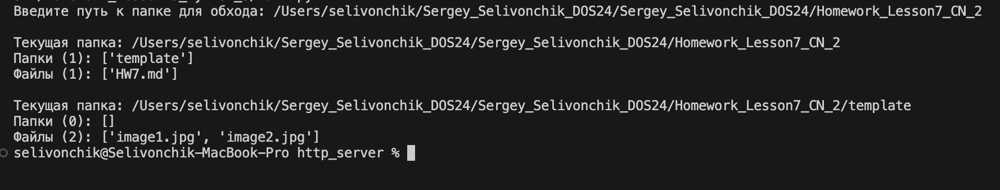

## Задание:
```bash 	
import os

for root, dirs, files in os.walk("."):
    print("Current folder:", root)
    print("Folders:", dirs)
    print("Files:", files)
```
улучшить скрипт для выполнения запроса и сортировки файлов и папок: дать возможность задавать путь к папке и исправить вывод

## Решение
1) Для проверки необходимо [main.py](main.py)

Пример вывода:
