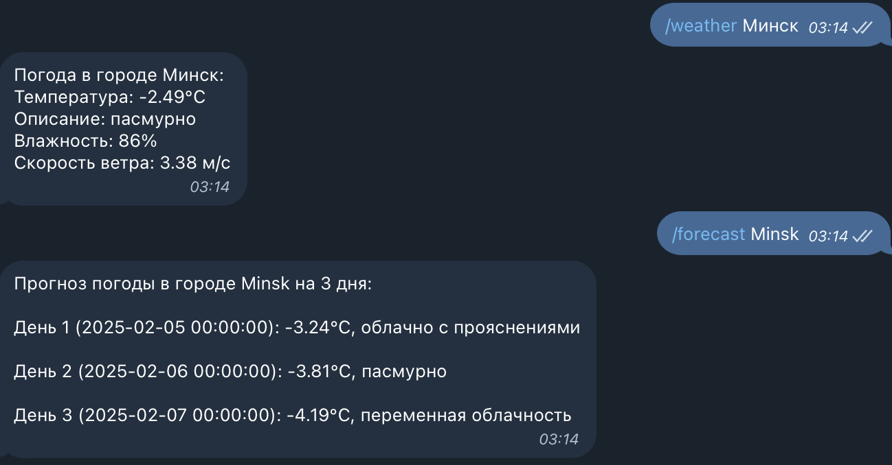

## Задание:
 	
1.* Написать бота для любого из мессенджеров, который бы возвращал погоду по запросу пользователя. Виды ответов:
Погода на 1 день
Погода на 3 дня
Погода по определённому городу

## Решение
1) Получение API-ключа для OpenWeatherMap. Перейдите на сайт OpenWeatherMap, зарегистрируйтесь и получите API-ключ.
2) Создание бота в Telegram
* Откройте Telegram и найдите бота @BotFather.
* Напишите команду /newbot и следуйте инструкциям для создания бота.
* Получите токен бота, который понадобится для интеграции с Python.
3) Создайте виртуальное окружение и установить зависимости:
```bash
mkdir ~/.venv
python3 -m venv ~/.venv
source ~/.venv/bin/activate

pip install python-telegram-bot requests

pip install python-dotenv

```
4) вставте ранее созданные API_KEY (API-ключ OpenWeatherMap) и  BOT_TOKEN(Telegram-бота)
5) Запускайте [main.py](main.py) в окружении ~/.venv
```bash
python3 ./Homework_Lesson26_Python_4_5/main.py
```

Пример вывода:
