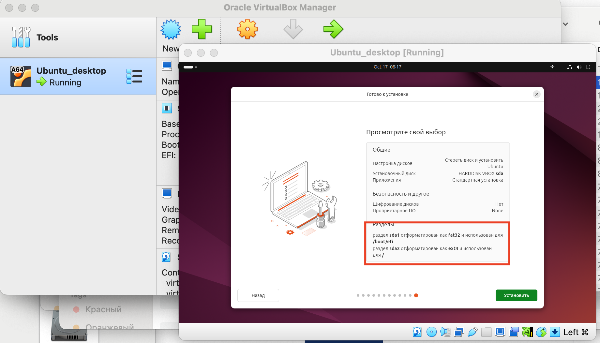
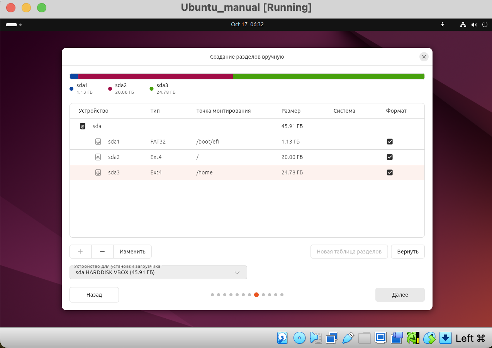
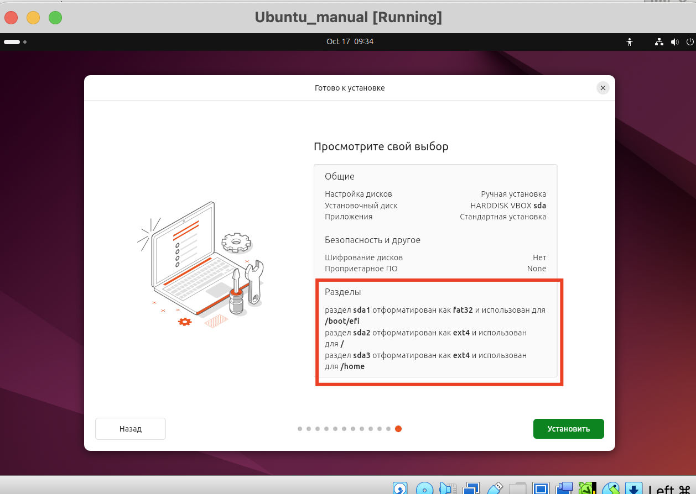
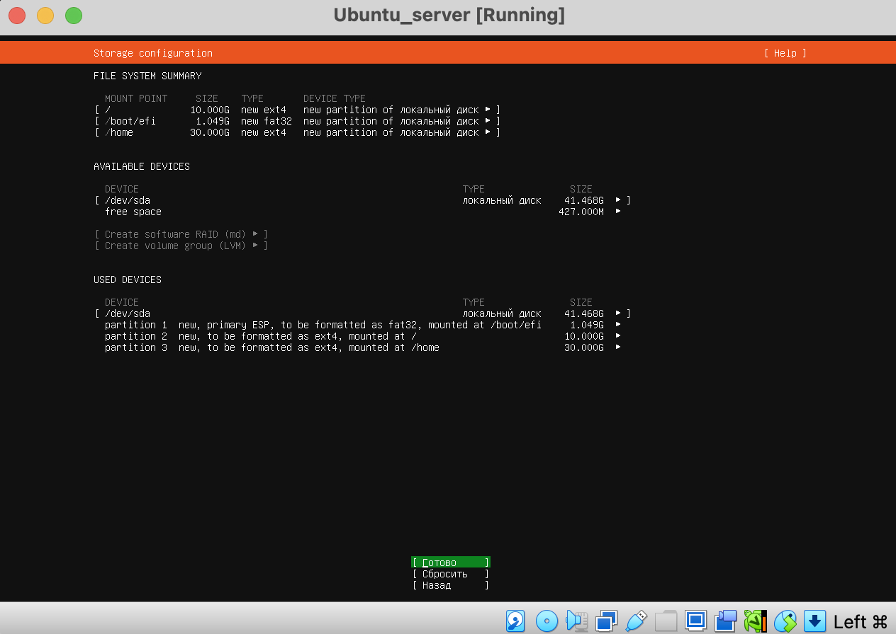
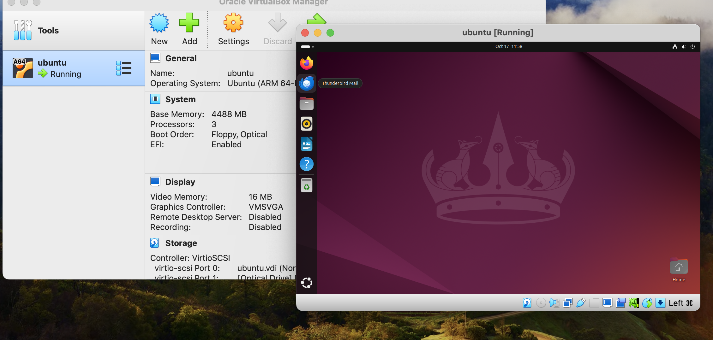

## Задание:
1. Создайте виртуальную машину и установите образ любой версии Ubuntu.
2. Необходимо проделать установку в режиме GUI на ваш выбор.
3. Добавляйте в отчёт только скриншоты процесса разметки диска

* Будет плюсом добавление в отчёт процесса создания своей структуры системы (напр., отдельный диск для папки home)
**То же самое, только установите ОС без графического окружения с командной строкой, а затем установите и настройте ОС с графическим окружением на ваш выбор

## Решение:
1. Скачал iso образ сервера Ubuntu 24.04.1 (Noble Numbat,64-bit ARM): https://cdimage.ubuntu.com/noble/daily-live/current/
2. Установил ubuntu в интерактвном режиме c автоматической установкой(разметкой дисков)

3. Установил ubuntu в интерактвном режиме c ручной установкой(разметкой дисков)


4. Скачал iso образ сервера ubuntu: https://ubuntu.com/download/server/arm.
Установил с разметкой диска.


Установил Ubuntu Desktop (графическое окружение).
```bash
sudo apt install ubuntu-desktop
```
Перезагрузите систему
```bash
sudo reboot
```

