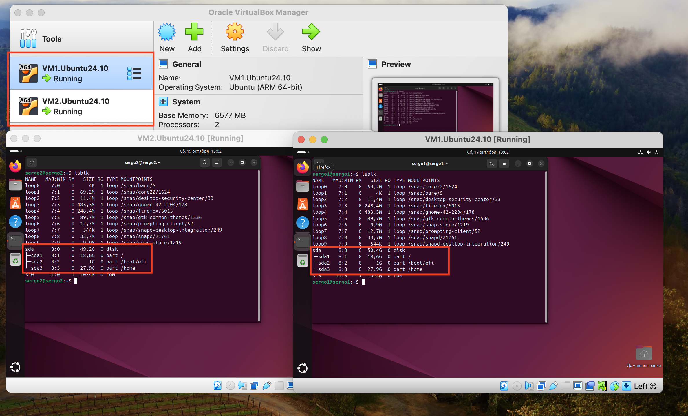
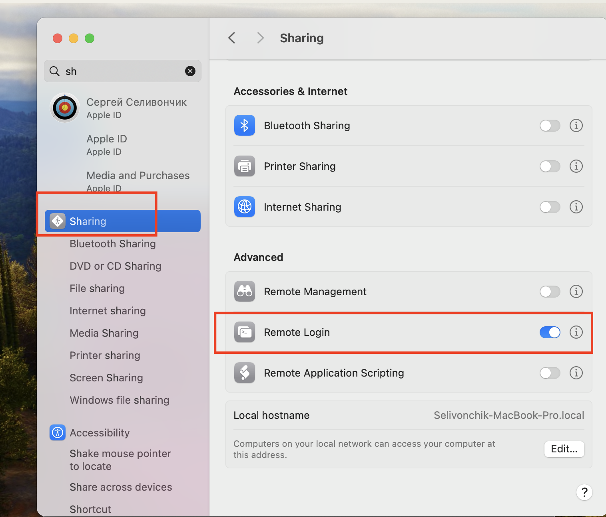
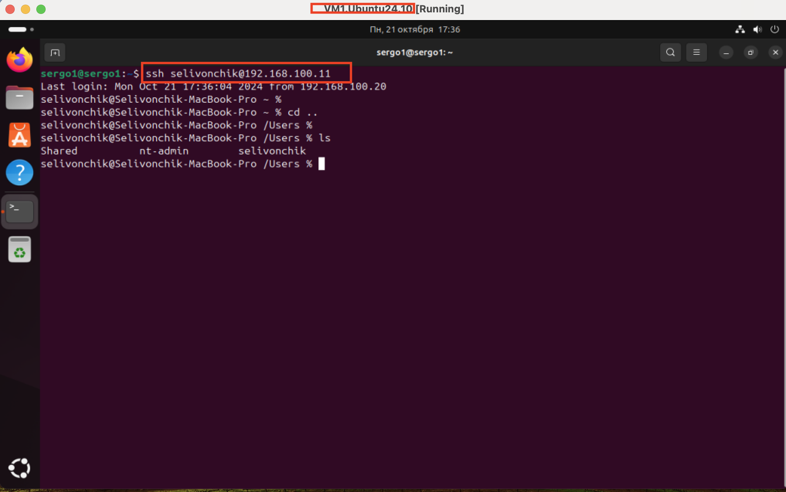
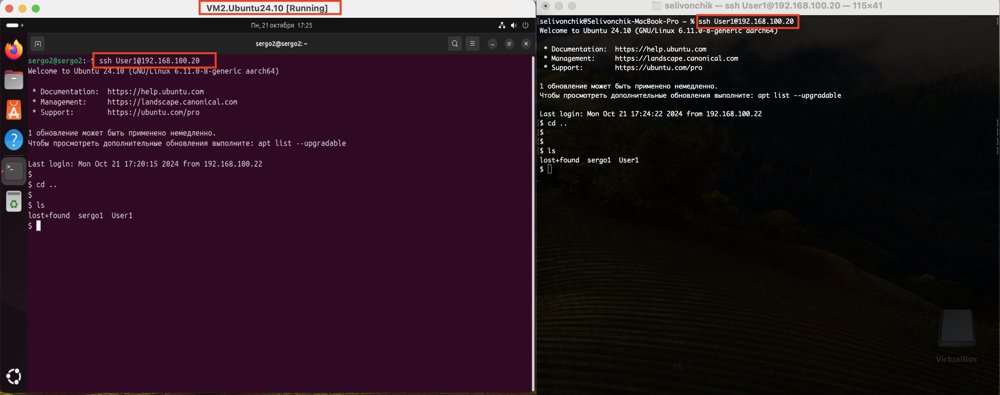
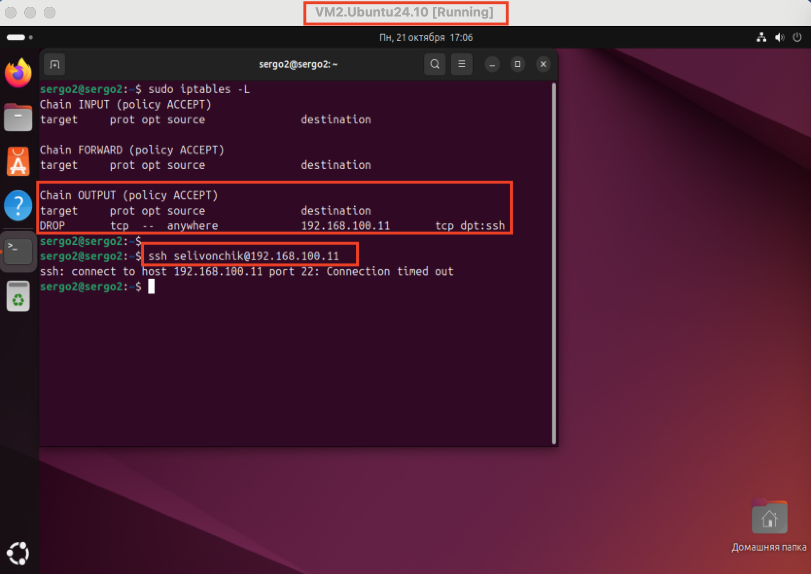

## Задание:
1. Создайте 2 виртаульных машины (далее - VM1, VM2. Вы можете дать любое удобное вам название). Используйте образ ubuntu24.10
2. Пройдите польностью все этапы установки и вручную разбейте свободное пространство на диски.
3. Настройте SSH-соеденение следующим образом: хостовая ОС -> VM1, VM1 -> хостовая ос, VM2 -> VM1, VM2 -x> хостовая ОС. Запрет соеденения можно осуществить любым удобной полиси через iptables.

* с помощью инструмента Hashicorp Packer создайте образы двух виртуальных машин с заранее подготовленными предустановками, описанными выше. Должно быть 2 конфига.

## Решение:
1. Скачал iso образ сервера Ubuntu 24.10 (Oracular Oriole,64-bit ARM): https://cdimage.ubuntu.com/daily-live/current/
2. Создал 2 виртаульных машины (VM1.Ubuntu24.10, VM2.Ubuntu24.10), установил ubuntu24.10 в интерактвном режиме c ручной установкой(разметкой дисков)


```bash
хостовая ОС - 192.168.100.11
VM1 - 192.168.100.20
VM2 - 192.168.100.22
```

3. Настройка сети , хостовой ОС mac(AppleSilicon).

``` VM1 -> хостовая ос ```

Настройка ssh подключения 
Открыть  Apple menu -> “System Preferences” -> sharing
включить плашку ```Remote Login```




4. Настройка сети , виртуальной машины VM1

``` хостовая ОС -> VM1 | VM2 -> VM1```

Настройка ssh подключения
```bash
# Set Up SSH Service
sudo apt install openssh-server
sudo systemctl start ssh
sudo systemctl enable ssh
# Инсталируем публичный ключ на удаленной машине
ssh-keygen -t rsa
ssh-copy-id <username>@192.168.100.22
ssh-copy-id <username>@192.168.100.11
```
в разделе “Network” VirtualBox , для Adapter 1 установил параметр “Bridged Adapter.”

```bash
# Add User to “vboxusers” Group
sudo groupadd vboxusers
sudo useradd -m <username>
sudo passwd <username>
sudo usermod -aG vboxusers <username>
```
```Слева VM2 / Справа хостовая ОС```


5. Настройка сети , виртуальной машины VM2

``` VM2 -x> хостовая ОС ```

Настройка ssh подключения
```bash
# Set Up SSH Service
sudo apt install openssh-server
sudo systemctl start ssh
sudo systemctl enable ssh
```
в разделе “Network” VirtualBox , для Adapter 1 установил параметр “Bridged Adapter.”

```bash
# Add User to “vboxusers” Group
sudo groupadd vboxusers
sudo useradd -m <username>
sudo passwd <username>
sudo usermod -aG vboxusers <username>
```

```bash
# запрещаем доступ с VM2 к хостовая ОС

sudo iptables -A OUTPUT -p tcp --dport ssh -d 192.168.100.11 -j DROP

# -A – добавить правило в цепочку;
# -p – вручную установить протокол (TCP, UDP, UDPLITE, ICMP, ICMPv6, ESP, AH, SCTP, MH);
# --dport - Указывает порт назначения пакета UDP, используя имя службы, номер порта или диапазон номеров портов.
# -d – установить IP получателя;
# -j – выбрать действие при подтверждении правила.
```
