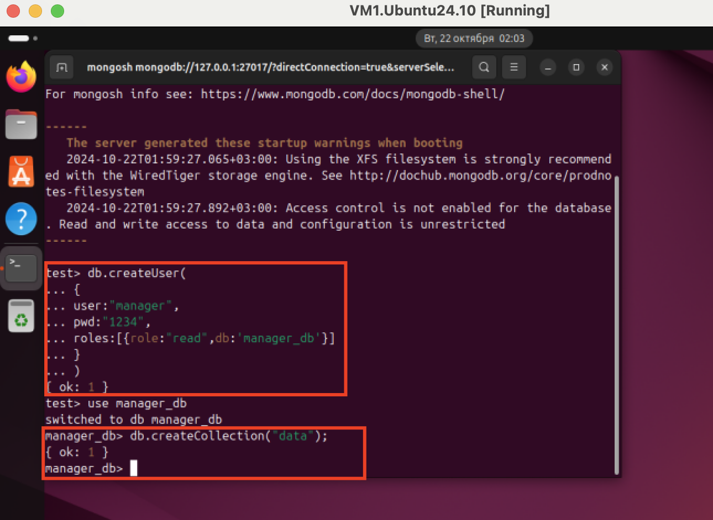

## Задание:
1. установить MongoDB.
*создать таблицу data; создать пользователя manager, у которого будет доступ
только на чтение этой таблицы.
2. ознакомиться с нижеуказанной статьей по теме «Bash»
https://habr.com/ru/post/52871/
3. написать Bash-скрипт в соответствии с требованиями:
Содержание скрипта: замена существующего расширения в имени файла на
заданное. Исходное имя файла и новое расширение передаются скрипту в
качестве параметров. Основное средство: нестандартное раскрытие
переменных. Усложнение: предусмотреть штатную реакцию на отсутствие
расширения в исходном имени файла.
4. написать Bash-скрипт в соответствии с требованиями:
Содержание скрипта: выделение из исходной строки подстроки с границами,
заданными порядковыми номерами символов в исходной строке. Усложнение:
предусмотреть возможность не выделения, а удаления подстроки.Основные
средства: команда cut, переменные оболочки
## Решение:
1. установить MongoDB.
```bash
sudo apt install curl
# импортируем открытый ключ для MongoDB
curl -fsSL https://pgp.mongodb.com/server-7.0.asc | sudo gpg -o /usr/share/keyrings/mongodb-server-7.0.gpg --dearmor

# добавляем репозиторий MongoDB 7.0 в директорию /etc/apt/sources.list.d
echo "deb [ arch=amd64,arm64 signed-by=/usr/share/keyrings/mongodb-server-7.0.gpg ] https://repo.mongodb.org/apt/ubuntu jammy/mongodb-org/7.0 multiverse" | sudo tee /etc/apt/sources.list.d/mongodb-org-7.0.list

# обновляем локальный список пакетов, в результате чего репозиторий MongoDB 7.0 будет добавлен в систему:
sudo apt update

# устанавливаем пакет MongoDB:
sudo apt install mongodb-org

# включаем
 службу MongoDB
sudo systemctl start mongod
sudo systemctl enable mongod

# подключаем интерфейс mongodb
mongosh
```

Создание пользователя и таблицы 
```bash
#создать пользователя
db.createUser(
  {
    user: "manager",
    pwd: "1234",
    roles: [ { role: "read", db: "manager_db" } ]
  }
)

use manager_db

#создание таблицы
db.createCollection("data"); 
```



2. создал file - ``` new_name.jpeg ``` и написал скрипт ``` task3.sh ```. 

Скрипт принимает 2 переменные: ```имя_файла``` и ```новое_расширение_файла```, в случае соблюдения условий меняет расширение файла.

Исключения: 
** Если остувствует файл с переданым именем , выдаст сообщение - ``` "File does not exist." ```
** Если расширение у файла отсуствует, выдаст сообщение - ``` "The file has no extension." ```

Пример для запуска скрипта:
```bash
sh task3.sh new_name.jpeg png
```

3. Создал скрипт ``` task3.sh ```. 
```bash
переменные:
input_string - редактируемая строка
start=11 - начальная позиция элемента
end=18 - конечная позиция элемента
delete - опция удаления(true - все кроме диапазона, false - сам диапазон)
```