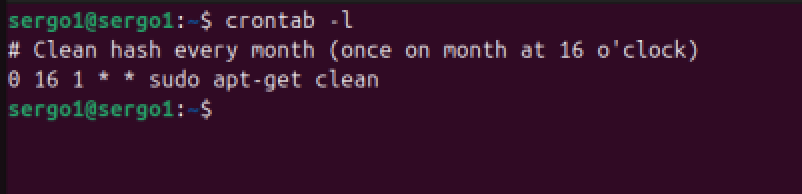
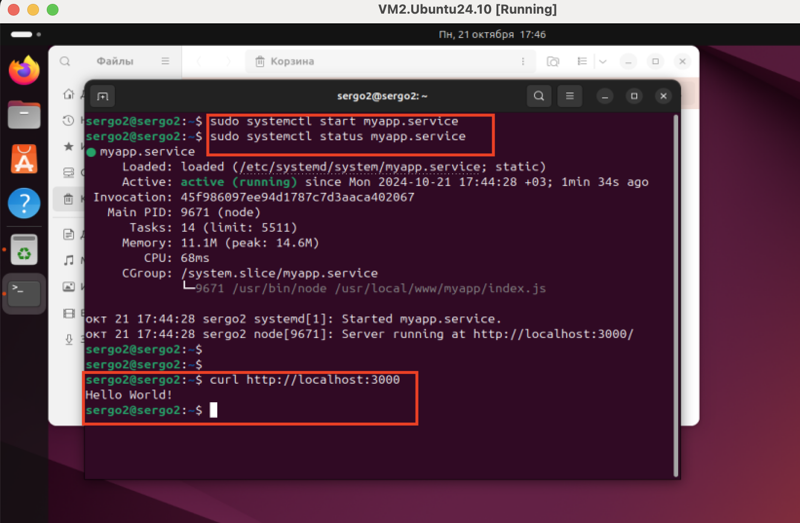

## Задание:
1. добавить в cron скрипт/команду,которая будет очищать кэш apt (кэшируемые пакеты, пакеты,которые не могут быть загружены) раз в месяц в 16 часов.
** запустить демон nodejs-приложения через systemd.
Запуск демона приложения через systemd

## Решение:
1. Создание cron скрипт/команды

```bash
# устанавливаем cron
sudo apt install cron
# проверяем включен ли cron в фоновом режиме
sudo systemctl enable cron
# открываем файл crontab на редактирование 
# Пользовательский файл crontab (устанавливается под конкретного пользователя)
crontab -e 
# системный файл crontab (имеется дополнительное поле, определяющее, для какого профиля пользователя должна запускаться каждая команда cronы)
sudo nano /etc/crontab 
# Добовляем правило в crontab
# Cron срабатывает - раз в месяц в 16 часов
0 16 1 * * sudo apt-get clean  

0 - minute 
16 - hour 
1 - day_of_month
* - month 
* - day_of_week 
sudo apt-get clean - запущенная программа очистки кеша
```



2. Запуск демона приложения через systemd
создаем файл service unit
/etc/systemd/system/myapp.service

```bash
# скачивам nodejs
sudo apt install nodejs
sudo apt install npm
# создаем файл service unit
sudo nano /etc/systemd/system/myapp.service
# добовляем конфигурационные параметры
[Service]
Environment=MYAPP_PORT=3000
ExecStart=/usr/bin/node /usr/local/www/myapp/index.js

Environment - нужные приложению переменные окружения.
ExecStart команда для запуска приложения. 
/usr/local/bin/node — это полный путь к nodejs его можно узнать командой: which node

/usr/local/www/myapp/index.js — полный путь к запускаемому приложению.

# создаем файл приложения
sudo nano /usr/local/www/myapp/index.js
# добовляем в файл код и сохраняем
const http = require('http');
const hostname = 'localhost';
const port = 3000;
const server = http.createServer((req, res) => {
  res.statusCode = 200;
  res.setHeader('Content-Type', 'text/plain');
  res.end('Hello World!\n');
});
server.listen(port, hostname, () => {
  console.log(`Server running at http://${hostname}:${port}/`);
});
# запускаем service unit
sudo systemctl start myapp.service
sudo systemctl status myapp.service
# проверяем развернулось ли приложение локально
curl http://localhost:3000

```
