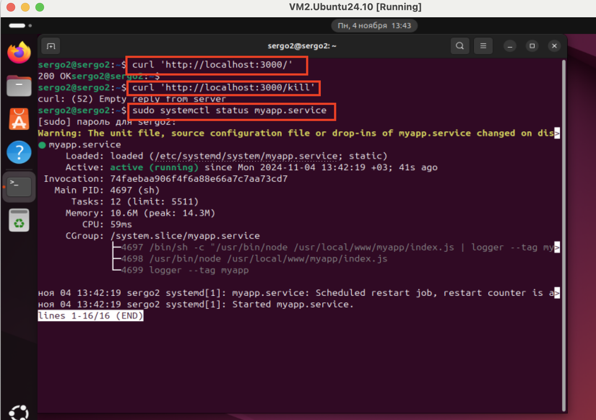

## Задание:
1. добавить в cron скрипт/команду,которая будет очищать кэш apt (кэшируемые пакеты, пакеты,которые не могут быть загружены) раз в месяц в 16 часов.
** запустить демон nodejs-приложения через systemd.
Запуск демона приложения через systemd

## Решение:
1. Создание cron скрипт/команды

```bash
# устанавливаем cron
sudo apt install cron

# проверяем включен ли cron в фоновом режиме
sudo systemctl enable cron

# открываем файл crontab на редактирование 
# Пользовательский файл crontab (устанавливается под конкретного пользователя)
crontab -e 
# системный файл crontab (имеется дополнительное поле, определяющее, для какого профиля пользователя должна запускаться каждая команда cronы)
sudo nano /etc/crontab 

# Добовляем правило в crontab
# Cron срабатывает - раз в месяц в 16 часов
0 16 1 * * sudo apt-get clean  

0 - minute 
16 - hour 
1 - day_of_month
* - month 
* - day_of_week 
sudo apt-get clean - запущенная программа очистки кеша
```


2. Запуск демона приложения через systemd

```bash
# скачивам nodejs
sudo apt install nodejs
sudo apt install npm

# создаем файл service unit
sudo nano /etc/systemd/system/myapp.service

# добовляем конфигурационные параметры
[Service]
ExecStart=/usr/bin/node /usr/local/www/myapp/index.js
Restart=always
# ExecStart команда для запуска приложения. 
# /usr/local/bin/node — это полный путь к nodejs его можно узнать командой: which node
# /usr/local/www/myapp/index.js — полный путь к запускаемому приложению.
# Restart=always - автоматический перезапуск приложения в случае падения

# создаем файл приложения
sudo nano /usr/local/www/myapp/index.js

# добовляем в файл код и сохраняем
const http = require('http');
// Get MYAPP_PORT from environment variable
const MYAPP_PORT = process.env.MYAPP_PORT;
http.createServer((req, res) => {
if (req.url === '/kill') {
// App die on uncaught error and print stack trace to stderr
throw new Error('Someone kills me');
}
if (req.method === 'POST') {
// App print this message to stderr, but is still alive
console.error(`Error: Request ${req.method} ${req.url}`);
res.writeHead(405, { 'Content-Type': 'text/plain' });
res.end('405 Method Not Allowed');
return;
}
// App print this message to stdout
console.log(`Request ${req.method} ${req.url}`);
res.writeHead(200, { 'Content-Type': 'text/plain' });
res.end('200 OK');
})
.listen(MYAPP_PORT);

# запускаем service unit
sudo systemctl start myapp.service
sudo systemctl status myapp.service
sudo systemctl start myapp.service

# проверяем развернулось ли приложение локально, и проверяем автоматический перезапуск после kill (см. скриншот ниже)

curl http://localhost:3000
curl http://localhost:3000/kill
sudo systemctl status myapp.service
```



3. Настройка логирования приложения
```bash
# настроим конфигурацию сервиса /etc/systemd/system/myapp.service , чтобы stdout процесс отправлялся в логгер пайпом (утилита для записи в syslog), а stderr слал через systemd

[Service]
Environment=MYAPP_PORT=3000
User=www-data
Group=www-data
# пайпим stdout в logger с тегом myapp
ExecStart=/bin/sh -c '/usr/local/bin/node /usr/local/www/myapp/index.js | logger
--tag myapp'
# stder шлём в syslog средствами systemd
StandardError=syslog
SyslogIdentifier=myapp
# устанавливаем уровень логирования: err
SyslogLevel=err
Restart=always

# Настроим правило обработки логов в syslog с помощью syslog-демона rsyslog. Его настройки лежат в /etc/rsyslog.d/. Создаем файл /etc/rsyslog.d/100-myapp.conf b настроиваем в syslog правила для записи в разные файлы:

$RepeatedMsgReduction off
if $programname == 'myapp' and $syslogseverity < 5 then
-/var/log/myapp/error.log
if $programname == 'myapp' and $syslogseverity >= 5 then
-/var/log/myapp/debug.log


# Для записи логов в файлы, необходимо так же настроить logrotate. Пример файла конфигурации /etc/logrotate.d/myapp:

/var/log/myapp/debug.log
/var/log/myapp/error.log {
rotate 7
daily
compress
missingok
notifempt
postrotate
invoke-rc.d rsyslog rotate > /dev/null
endscript
}

```