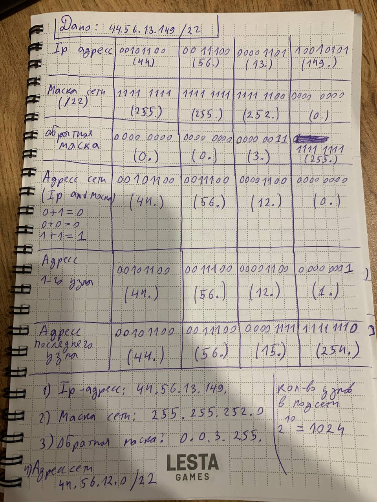
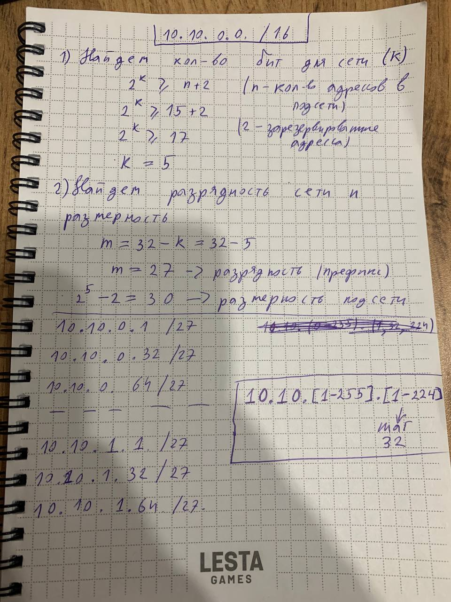

## Задание:
1. Зная IPv4-адрес, а также исходную и маску подсети,
определить следующие параметры.
• Сетевой адрес этой подсети
• Широковещательный адрес этой подсети
• Диапазон адресов узлов этой подсети
• Количество созданных подсетей
• Количество узлов в подсети
```bash 
44.56.13.149/22 
```
2. Имеется сеть 10.10.0.0/16, разбить на подсети с не менее чем 350 доступными адресами.

## Решение

1. 


2. 


