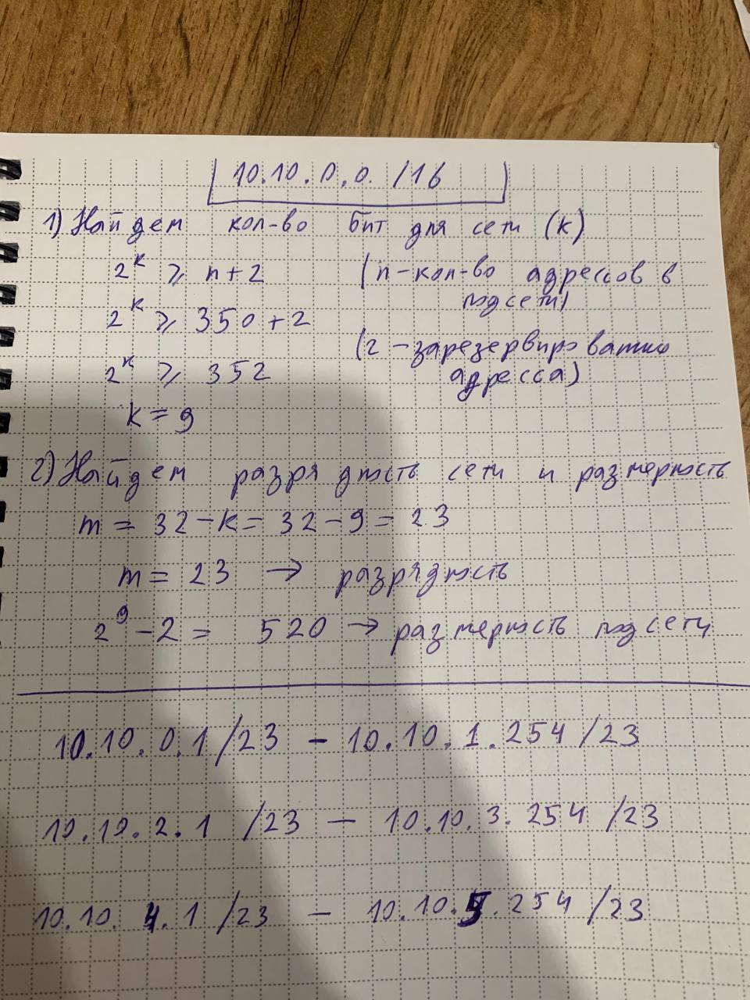

## Задание:
1. Зная IPv4-адрес, а также исходную и маску подсети,
определить следующие параметры.
• Сетевой адрес этой подсети
• Широковещательный адрес этой подсети
• Диапазон адресов узлов этой подсети
• Количество созданных подсетей
• Количество узлов в подсети
```bash 
44.56.13.149/22 
```
2. Имеется сеть 10.10.0.0/16, разбить на подсети с не менее чем 350 доступными адресами.

## Решение

1. 


2. 
Посчитаем кол-во бит (k) и заррядность(префикс) (m) для подсети, содержащей не менее 350 адессов:

```bash 
# n -> количество адресов подсети
# k -> количество бит подсети
# 2 -> зарезервированные адреса (Индентификатор сети + Широковещательный адрес)

2^k >= n + 2    
2^k >= 350 + 2  
2^9 >= 352
k = 9

# размерность подсети -> 2^k - 2
2^9 - 2 = 512 - 2 = 510 

# m -> заррядность(префикс) подсети

m = 32 - k = 32 - 9 = 23
m = 23
```

Сеть 10.10.0.0/16 содержит 65,536 адресов (2^16).
Подсеть с префиксом /23 содержит 512 адресов.

Чтобы узнать количество возможных подсетей /23 в сети /16, нужно разделить общее количество адресов на размер одной подсети:

65536\512 = 128

Таким образом, сеть 10.10.0.0/16 можно разделить на 128 подсетей с префиксом /23.

Сеть 10.10.0.0/16 может быть разделена на подсети с префиксом /23:

Сеть 10.10.0.0/23

Сеть 10.10.2.0/23

Сеть 10.10.4.0/23

Сеть 10.10.6.0/23
.....

Вот этого не хватает

