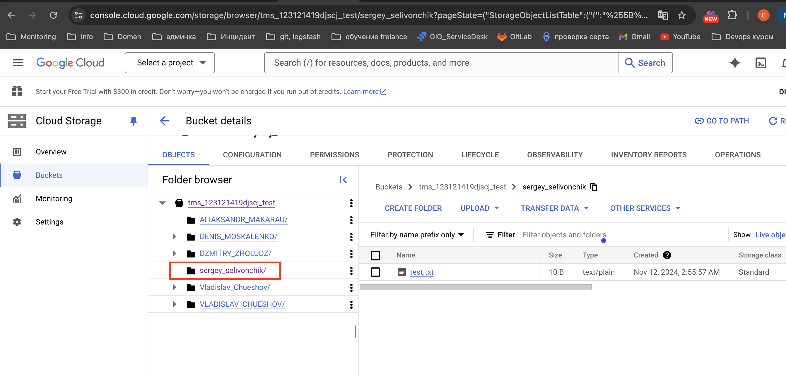

## Задание:
RSYNC либо RCLONE
1. сделать синхронизацию с облачных хранилищем (S3, GCP Storage) c указанием NAME_SURNAME в имени папки
2. FDISK + LVM
3. *синхронизировать между собой две папки на двух разных вм-ках
4. *синхронизировать папки на двух вмках и ещё на GCP
____________________________________________
ссылки на GCP bucket
https://console.cloud.google.com/storage/browser/tms_123121419djscj_test
gs://tms_123121419djscj_test
## Решение

1. Настроим rsync на VM ubuntu.24.10:
   
```bash
# download python < version 3.11 (source https://thepythoncorner.com/posts/2022-05-07-managing-python-versions-with-pyenv/)
# sudo add-apt-repository ppa:deadsnakes/ppa
# sudo apt update
# sudo apt install python3.11

sudo snap install curl
sudo apt install git
curl https://pyenv.run | bash

# pyenv в начало переменной среды PATH.
# Теперь отредактируйте файл ~/.bashrc и добавьте следующие строки:
export PYENV_ROOT="$HOME/.pyenv"
[[ -d $PYENV_ROOT/bin ]] && export PATH="$PYENV_ROOT/bin:$PATH"
eval "$(pyenv init -)"
eval "$(pyenv virtualenv-init -)"

# установки всех рекомендуемых зависимостей:
sudo apt-get install -y build-essential libssl-dev zlib1g-dev libbz2-dev \
libreadline-dev libsqlite3-dev wget curl llvm libncurses5-dev libncursesw5-dev \
xz-utils tk-dev libffi-dev liblzma-dev git

pyenv install 3.10.4 -v
```

```bash
# Installing gsutil as part of the Google Cloud CLI (source https://cloud.google.com/storage/docs/gsutil_install)

sudo apt-get update
# It has apt-transport-https and curl installed: 
sudo apt-get install apt-transport-https ca-certificates gnupg curl
# Import the Google Cloud public key. 
curl https://packages.cloud.google.com/apt/doc/apt-key.gpg | sudo gpg --dearmor -o /usr/share/keyrings/cloud.google.gpg
# Add the gcloud CLI distribution URI as a package source. 
echo "deb [signed-by=/usr/share/keyrings/cloud.google.gpg] https://packages.cloud.google.com/apt cloud-sdk main" | sudo tee -a /etc/apt/sources.list.d/google-cloud-sdk.list
# Update and install the gcloud CLI: 
sudo apt-get update && sudo apt-get install google-cloud-cli
# Run gcloud init to get started: 
gcloud init
```

```bash
# устанавливаем rsync 
sudo apt-get install rsync  

# создаем конфигурационный файл /etc/rsyncd.conf
sudo nano /etc/rsyncd.conf
# записываем его, подставляя ip своей VM
uid = swift
gid = swift
log file = /var/log/rsyncd.log
pid file = /var/run/rsyncd.pid
address = 192.168.100.20
[account]
max connections = 2
path = /srv/node/
read only = false
lock file = /var/lock/account.lock
[container]
max connections = 2
path = /srv/node/
read only = false
lock file = /var/lock/container.lock
[object]
max connections = 2
path = /srv/node/
read only = false
lock file = /var/lock/object.lock

# запускаем rsync и ставим ему статус enable
sudo service rsync start
sudo systemctl enable rsync 
```

```bash
# sync local folder with GCP
gsutil cp -r /home/backup/sergey_selivonchik/ gs://tms_123121419djscj_test
gsutil rsync -d -r /home/backup/sergey_selivonchik gs://tms_123121419djscj_test
```


## Автоматическая синхронизация с GCP при внесении изменений в директорию (в процессе написания!!!)

```bash
# create file watch_dir.sh
sudo nano watch_dir.sh
chmod +x watch_dir.sh

#!/bin/sh
WATCH_DIR="/home/backup/sergey_selivonchik"
while inotifywait -r -e modify,create,delete "$WATCH_DIR"; do
echo "start sync dir"
cd /home/backup/sergey_selivonchik
gsutil rsync /home/backup/sergey_selivonchik gs://tms_123121419djscj_test
done

# create service unit
sudo nano /etc/systemd/system/mysync.service

[Service]
ExecStart=bash /usr/bin/watch_dir.sh

# start service
sudo systemctl start mysync.service
```
