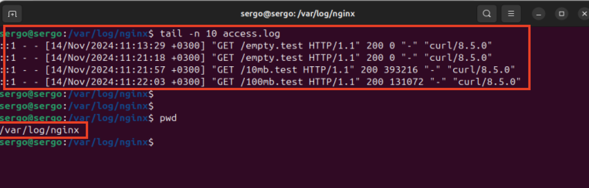
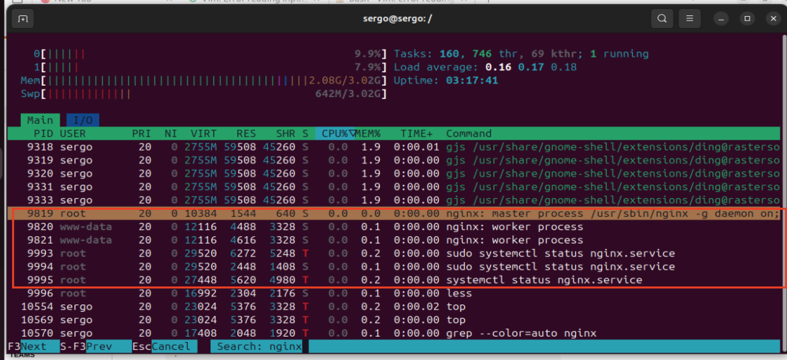

## Задание:
Цель: освоить принципы работы текстового редактора Vim. Ознакомиться с
процессом логирования в Linux. Научиться определять уровень загрузки
системы.
1. Задание 1: Создание нового файла с использованием vim
- 1.1 Создайте каталог с именем practice.
- 1.2 Перейдите во вновь созданный каталог.
- 1.3 Вызовите vim и создайте файл memo (% vim memo).
- 1.4 Нажмите клавишу i и вводите следующий текст.
` @REM AUTOEXEC.BAT DTK 386/40
ECHO OFF
Path c:\dos;c:\stacker;c:\Util;c:\NC;C:\MOUSE
SET PROMPT=$P$G
SET TMP=C:\TEMP
LH C:\UTIL\RKEGA
goto %config%
:student1
C:\DOS\SMARTDRV.EXE C+ 2048 1024
goto nc
:student2
APPEND E:\tc\bgi
:teacher
PATH %path%E:\windows;e:\tc;e:\tc\bin;e:\foxpro;
goto win
:ONC
PATH %path%G:\pctcp;
SET TZ=GMT
goto nc
:nc
nc.exe
goto end
win.com
:end `
- 1.5 Нажмите клавишу <ESC> для перехода в командный режим после завершения
ввода текста.
- 1.6 Нажмите : (двоеточие) для перехода в режим последней строки и внизу вашего
экрана появится приглашение в виде двоеточия.
- 1.7 Нажмите w(записать) и q(выйти), а затем нажмите клавишу <RETURN> для
сохранения вашего текста и завершения работы.

2. Задание 2: Редактирование существующего файла
- 2.1 Вызовите vim на редактирование файла memo (% vim ~/practice/ memo).
- 2.2 Установите курсор на начало слова DTK в первой строке.
- 2.3 Перейдите в режим вставки и наберите 1-203; теперь текст будет выглядеть так:
`@ REM AUTOEXEC.BAT 1-203 DTK 386/40`
Нажмите <ESC>, чтобы вернуться в командный режим.
- 2.4 Установите курсор на четвертую строку и сотрите слово C:\MOUSE.
- 2.5 Перейдите в режим вставки и наберите следующий текст: С:\GMOUSE ;
нажмите <ESC>, чтобы вернуться в командный режим.
- 2.6 Установите курсор на последней строке файла. Вставьте строку, содержащую
следующий текст:extention 287
- 2.7 Замените словоextentionнаx.
- 2.8 Удалите последнюю строку.
- 2.9 Введите команду отмены изменений для отмены последней команды.
- 2.10 Установите курсор на первую строку (строка 5), вставьте перед ним пустую
строку и введите следующий текст:
` @REM 22 apr. 1999 `
Оставьте пустую строку между новым разделом и следующим за ним. Нажмите
<ESC>, чтобы перейти в командный режим.
- 2.11 Введите символ : (двоеточие) для перехода в режим последней строки.
Запишите произведенные изменения на диск и выйдите из vim.

3. Задание 3:
- 3.1 Вернитесь в ваш домашний каталог.
- 3.2 Скопируйте файл testcase.c(предварительно осуществив его поиск) в
директории~/practice и вызовите vim для редактирования файла.
- 3.3 Перейдите в каталог~/practice и вызовите vim для редактирования файла
testcase.c
- 3.4 Включите отображение номеров строк. Сколько строк в данном файле?
- 3.5 Вернитесь в начало файла.
- 3.6 Найдите слово WORD и замените его на IGNORE.
- 3.7 Найдите слово Reset и замените его на set.
- 3.8 Найдите слово input и замените его на output.
- 3.9 Вставьте строку, заполненную вопросительными знаками <?> под строкой :state
= WORD
- 3.10 Скопируйте строки с 16 по 29 в файл printwords.c
- 3.11 Перейдите в конец файла и удалите две последние строки.
- 3.12 Вернитесь в начало файла и перенесите фрагмент текста, начинающийся
словами /*Manifests ..., в конец файла.
- 3.13 Запишите произведенные изменения на диск в файл testvim.c и выйдите из
редактора.
4. Задание 4:
- 4.1 Установить утилиту nginx, посмотреть ее логи и также уровень нагрузки на ОС.
Просмотрите логи действий пользователей системы.
Опционально :
- 4.2 * Установите веб-сервер Apache 2.
- 4.3 *Установите утилиту logrotate, которая помещает access.log и error.log веб-сервера
Apache в /var/log/app/. В системе он работает как пользователь и группа www-data
## Решение
1. Задание 1:
скопируйте task1.sh на свою VM , и запустите:
``` bash
./task1.sh
```
2. Задание 2:
- выполнил
Изученные команды 
``` bash
# справка vim
man vim
# Выход
:q! - выйти без сохранения;
:wq - записать файл и выйти;
ZZ - записать файл и выйти (Если файл не изменяли, то записываться он не будет)
# Поиск
/фраза - поиск фразы во всем документе.
n - следующее найденное (вниз) N - предыдущее (вверх).
# Отмена изменений
u — отмена последней команды;
U — отмена всех последних изменений в строке, если строка удалена, то применить эту команду к данной строке будет невозможно.
# Ввод текста
i — перейти в режим ввода с текущей позиции
```

3. Задание 3:
Изученные команды 
``` bash
# включить отображение номеров строк
:set number
# найти и заменить слова в файле.
:%s/старое_слово/новое_слово/g 
```
4. Задание 4:
Устанавливаем и запускаем nginx:
`sudo apt install nginx`
`sudo systemctl start nginx.service`
Проверим логирование nginx
```
bash
# создаlbv два файла размером в 10 и 100 мегабайт:
sudo truncate -s 10M /var/www/html/10mb.test
sudo truncate -s 100M /var/www/html/100mb.test
# создадим пустой файл empty.test
sudo touch /var/www/html/empty.test

# установим curl 
sudo apt install curl

# для проверки access лога nginx запустим команду 
curl -i http://localhost/empty.test
curl -i http://localhost/10mb.test
curl -i http://localhost/100mb.test

# посмотрим лог nginx
tain -n 100 /var/log/nginx/access.log


# проверяю уровень нагрузки на OS, с помощью htop (по F3 ищу nginx процессы)
# по скрину видно что nginx процессы находятся в статусе sleep (S), соотвественно нагрузки нет
`sudo apt install htop`

```


Установить утилиту nginx, посмотреть ее логи и также уровень нагрузки на ОС.
Просмотрите логи действий пользователей системы.


