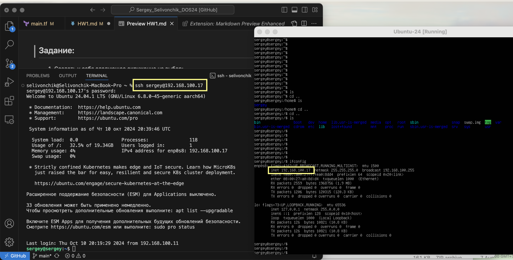

## Задание:
1. Создать у себя следующее окружение на выбор:
    - WSL + Visual Studio Code*
    - Any Linux distro in alongside (GRUB) 
    - Pure Linux – Ubuntu 
*IDE на выбор: Visual Studio Code, vim IDE, Atom, Visual Studio 

2. Создать аккант на гитхабе и добавить меня (https://github.com/deng4) к себе в репозиторий с админ правами. 
Название репозитория по следующему образцу: Name_Surname_DOS24.

3. Описать локальную инфраструктуру в terraform, код загрузить в репозиторий.

## Решение:
1.  Установил VirtualBox для MacOS/Apple Silicon: https://www.virtualbox.org/wiki/Downloads
2. Скачал iso образ сервера ubuntu: https://ubuntu.com/download/server/arm
3. развернул ubuntu server в VirtualBox и настроил ssh по гайду: https://www.devskillbuilder.com/setting-up-ubuntu-server-in-virtualbox-and-accessing-it-via-ssh-70b1ed9fa3ae
4. Настройка ssh подключения к ubuntu server
```bash
# Set Up SSH Service
sudo apt install openssh-server
sudo systemctl start ssh
sudo systemctl enable ssh
```
в разделе “Network” VirtualBox , для Adapter 1 установил параметр “Bridged Adapter.”

```bash
# Add User to “vboxusers” Group
sudo groupadd vboxusers
sudo usermod -aG vboxusers <username>
```
5. Установил Visual Studio Code: https://code.visualstudio.com/download
6. В терминале VS code подключился по ssh к ubuntu server(VirtualBox).
```Слева VS code. Справа VirtualBox.```


7. Описать локальную инфраструктуру в terraform: main.tf
